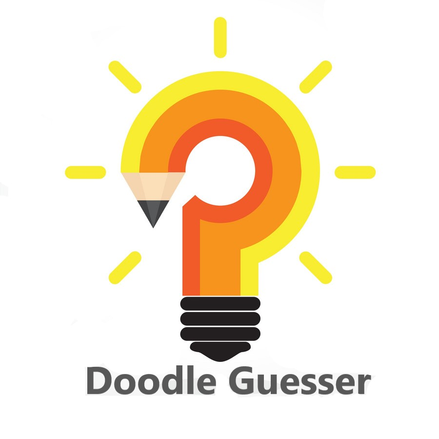

Doodle Guesser is an implementation of Neural Net Minus, a neural network library I built from scratch:

https://github.com/wqding/Neural-Net-Minus

My custom NN is able to consistently achieve at least 85% accuracy with the dataset.

The training and testing data is from the google quick draw dataset: 

https://console.cloud.google.com/storage/browser/quickdraw_dataset/full/numpy_bitmap
